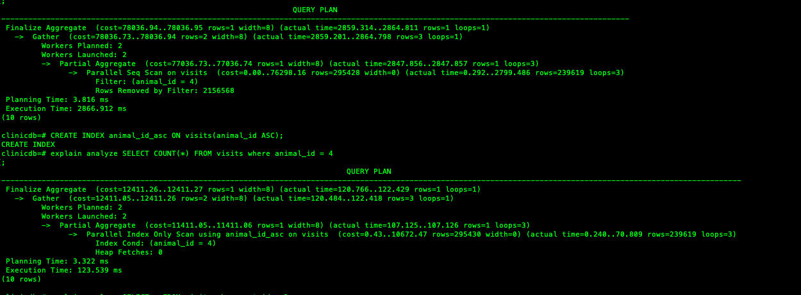
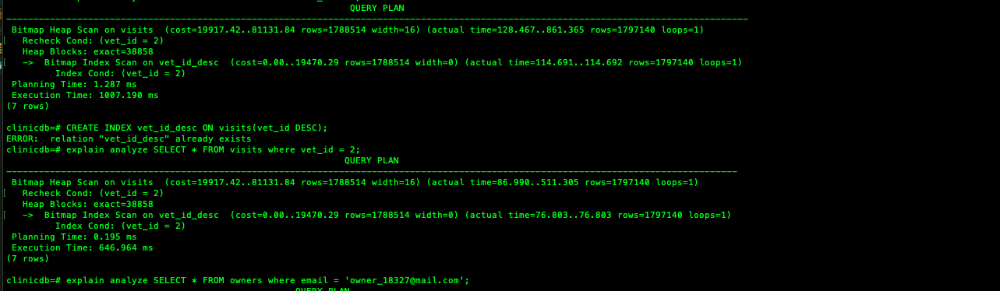
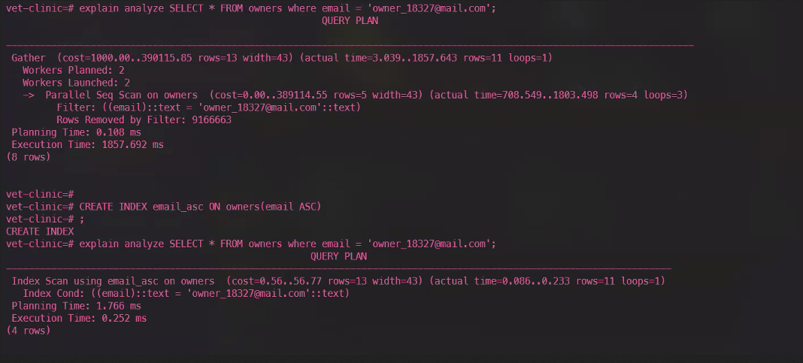

# vet-clinic-database

> A vet clinic database audited to improve its performance.

Vet clinic is a database that at first had performance problems when seeded with big amounts of data. Now it's lightning fast.

## Queries performance before-after






## Made with

- PostgreSQL
- VSCode


## Future Updates & Roadmap

- More optimizing

## Getting Started

To get a local copy up and running follow these simple example steps:

1. Under the repository name, click the Clone or download green button.


2.Copy the URL given by clicking the clipboard button

3.Open a terminal window in your local machine and change the current directory to the one you want the clone directory to be made.

4.Type  git clone and the paste the URL you previusly copied to the clipboard

5.Change the current directory to the newly created folder

6.Create the database using the schema.sql file with PostgreSQL (using either psql terminal or Pgadmin)

7.Add the email column inside the owners table 

`ALTER TABLE owners ADD COLUMN email VARCHAR(120);`

8. Insert data into your database with the following commands 

```bash
`INSERT INTO visits (animal_id, vet_id, date_of_visit) SELECT * FROM (SELECT id FROM animals) animal_ids, (SELECT id FROM vets) vets_ids, generate_series('1980-01-01'::timestamp, '2021-01-01', '4 hours') visit_timestamp;`

`insert into owners (full_name, email) select 'Owner ' || generate_series(1,2500000), 'owner_' || generate_series(1,2500000) || '@mail.com';`

```

9. Auditing performance

`explain analyze SELECT * FROM visits where vet_id = 2;`

`explain analyze SELECT * FROM owners where email = 'owner_18327@mail.com';`

`explain analyze SELECT COUNT(*) FROM visits where animal_id = 4;`

## Authors

👤 **Miguel Tapia**

- Github: [@meltrust](https://github.com/meltrust)
- Linkedin: [linkedin](https://www.linkedin.com/in/meltrust/)
- Or talk to me directly at: original.mtapia@outlook.com

👤 **Amal Hersi**

- GitHub: [Amal Hersi](https://github.com/Amalcxc)
- Twitter: [@Amalcx4](https://twitter.com/home?lang=en)
- LinkedIn: [Amal Hersi](https://www.linkedin.com/in/amal-hersi-a29583205/)


## 🤝 Contributing

Contributions, issues and feature requests are welcome!

Feel free to check the [issues page](issues/).

## Show your support

Give a ⭐️ if you like this project!

## Acknowledgments

- Hat tip to anyone whose code was used
- Inspiration
- etc

## 📝 License

This project is [MIT](lic.url) licensed.
